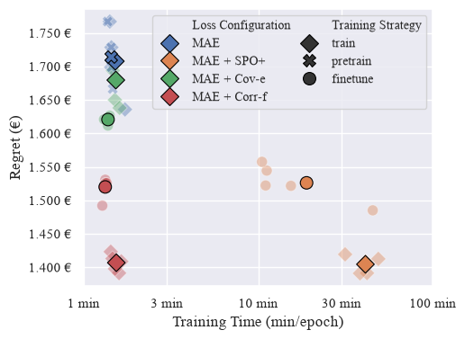

# Scalable Learning of BESS Schedule Optimization-Aligned Electricity Price Forecasting

**Type:** Master's Thesis

**Author:** Daniyar Abdimomunov

**Supervisor:** Prof. Dr. Stefan Lessmann

**1st Examiner:** Prof. Dr. Mendling 


## Table of Content

- [Summary](#summary)
- [Working with the repo](#Working-with-the-repo)
    - [Dependencies](#Dependencies)
    - [Setup](#Setup)
- [Reproducing results](#Reproducing-results)
    - [Experiment execution](#Experiment execution)
    - [Evaluation](#Evaluation)
- [Project structure](-Project-structure)

## Summary

Battery Energy Storage Systems (BESS) are becoming an increasingly important tool for managing electricity price volatility of networks with high share of renewable energy sources (RES). Decision-focused learning (DFL) methods been employed to align electricity price forecasting (EPF) with BESS scheduling decisions, shifting the learning objective form prediction accuracy to economic utility. However, standard DFL approaches often incur additional computational complexity that may prevent them from being used in more advanced, deep learning EPF architectures. To address the gap between scalable BESS-aligned learning and state-of-the-art EPF models, this study proposes assocation- and dispersion-based loss functions as a scalable alternative for DFL and conducts a comparative evaluation of their performance-efficiency trade-off. Through this evaluation, this study finds that a relaxed, composite loss based on dispersion-based Corr-f measure is able to match the downstream decision performance of the benchmark DFL approach while avoiding the additional computational burden.




**Keywords**: Electricity Price Forecasting, Battery Energy Storage Systems, Decision-focused Learning, Cov-e, Corr-f.

## Working with the repo

### Dependencies

Python==3.11.7

List of dependencies included in `requirements.txt`.

### Setup

1. Clone this repository.

2. Install requirements.
```bash
pip install --upgrade pip
pip install -r requirements.txt
```

## Reproducing results

This repository is strucutred around Python Notebooks, found under the `notebooks` directory.
The notebooks strucutred as follows:
- 01_bess_scheduling.ipynb: Provides an isolated example of how to solve a BESS scheduling optimization model. 
- 02_data_preparation.ipynb: Provides an example of how to load data into a tensor Dataset and Data Loader.
- 03_model_training.ipynb: Provides an example of how to train a single model under the MLFlow framework.
- 04_finetuning_with_composite_losses.ipynb: Provides an example of how to finetune a pretrained model with a composite loss.
- 05_experiment.ipynb: Provides the main parameters for the execution of the experiment.
- 06_evlauation.ipynb: Provides tables and figures used in the paper.

### Experiment execution

To reproduce the results, you must first launch the local MLFlow Tracking Server and UI by running the following command in terminal.

`mlflow ui`

Then you can run the 05_experiment.ipynb notebook, which will train models under the specified experiment parameters. 
While all the experiment parameters are provided, it is best to execute the experiment runs in smaller batches due to significant training time.

### Evaluation

The results of the experiment runs are saved in `mlflow.db`. The evaluation of the results can be found in `06_evaluation.ipynb`.
To access the database, you again must first connect the local MLFlow Tracking Server by running the `mlflow uì` command in terminal.

## Project structure

```bash
├── data                                            -- stores csv file, and cached solutions  
└── notebooks
    ├── 01_bess_scheduling.ipynb                    -- example notebook for solving optimization model
    ├── 02_data_preparation.ipynb                   -- example notebook for loading data into tensor Dataset
    ├── 03_model_training.ipynb                     -- example notebook for training a single model 
    ├── 04_finetuning_with_composite_losses.ipynb   -- example notebook for finetuning a pretrained model
    └── 05_experiment.ipynb                         -- notebook for executing experiment
    └── 06_evaluation.ipynb                         -- notebook for tables and figures
└──  src
    ├── exp                                         -- experiment functions
    ├── evaluation                                  -- evaluation helper functions
    ├── losses                                      -- loss functions
    ├── metrics                                     -- evaluation metrics
    └── models                                      -- models 
    └── utils                                       -- dataset objects, and optimization model  
├── timexer                                         -- imported library for TimeXer model
├── config.py                                       -- configuration file for
├── mlflow.db                                       -- database with experiment results
├── README.md
└── requirements.txt                                -- required libraries               
```
